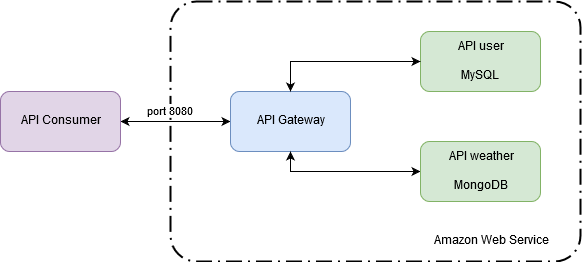
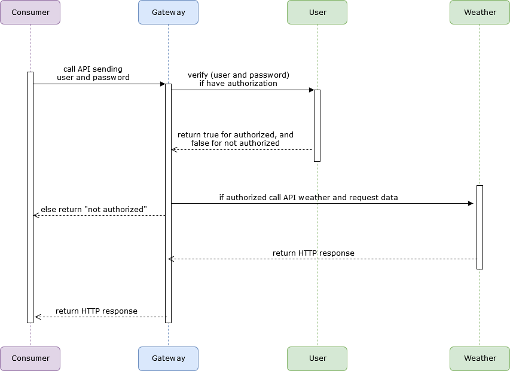

<!DOCTYPE html>
<html lang="en">
<head>
	<meta http-equiv="Content-Language" content="pt-br, en">
	<title>API document</title>
</head>
<body>
	<h2>Introduction</h2>
	

		This project consists in a data product design that returns the weather for a region and time range.This documentation explain how our application works, used technologies and where we will host it.
	

	

		<h4>Summary</h4>
		<ul>
			<li><a href="#diagram">Architecture diagram</a></li>
			<li><a href="#install">Requirements and technologies</a></li>
			<li><a href="#request">Using the API</a></li>
			<li><a href="#ex">Examples</a></li>
		</ul> 
	

	 

	<h2 id="diagram"> Architeture diagram</h2>
	

		We will have three different applications.
		"API weather" manages weather data; 
		"API user" limits accesses according to authentication; 
		and "API gateway": makes the connection between the user and the other APIS (nginx).
	

	 
	

		 
		<caption>Figure 1 - Architeture diagram, show us how client will call our product</caption>
	
 
	 
	

		In the used strategy the client will not have direct access to the APIs. The user must use the API Gateway to communicate with the other APIs.  

		The gateway automatically proxy all requests to the microservices, using their application name, as: when "API user" is registered, it is available on the gateway on the localhost:8080/user url. 

		It will also be responsible for the authentication of users and making this interface between client requests (API consumer) and data product (API weather). 

		Zuul proxy and docker technologies will be used.JWT authentication too.
	

	 
	

		 
		<caption>Figure 2 - Flow example</caption>
	
 
	 
	

		API consumer (client who want to used our project) requests autentication. The API gateway makes the "interface" between client and microservices, and send request to APi user. So it search in MySQL database for client authentication. If the authentication is found, send "true" to API consumer to continue to next step. Else return "false" and the gateway returns "not authorized".
		 
		In the next step, API consumer request any CRUD operation. The gateway verify if  it have the obrigatory datas. In case of complete data, send request to API weather who search in Mongodb database and return values. API gateway send to client this values.
	

	 

	<h2 id="install">Requirements and technologies</h2>
	

		This project will be programmed in python), applying the Flask framework for the APIs.The Amazon Web Service will be used as cloud service.
		 
		<table>
			<caption>Project preferences</caption>
			<tr>
				<td>Language</td>
				<td>Python - 3.6</td>
			</tr>
			<tr>
				<td>Framework</td>
				<td>Flask - 1.0</td>
			</tr>
			<tr>
				<td>Cloud</td>
				<td>Amazon Web Service</td>
			</tr>
			<tr>
				<td>Databases</td>
				<td>MySQL and   MongoDB</td>
			</tr>
		</table>
		 

		Each API will have its own database because both have different needs and characteristics. The "API users" use MySQL to attend the relational data as: a table with authorization types in the API, another with login data and so forth.
		
		The "API weather" used MongoDB because of geographic needs (nosql  facilitates clusters); Or because the data from weather stations (or possibles dataloggers) may come different, like in one region comes the pressure value and in another it doesn't.
	

	 

	<h2 id="request">Using the API</h2>
	

		We have some "key files" in this repository. 
		<ul>
			<li>The file "manifest" will install all microservice with the code "cf push". </li>
			<li>The file "requirements" have all python library requirements</li>
		</ul>
	

	 

	<h2 id="ex">Examples</h2>
	

		
	

	 
	
</body>
</html>
